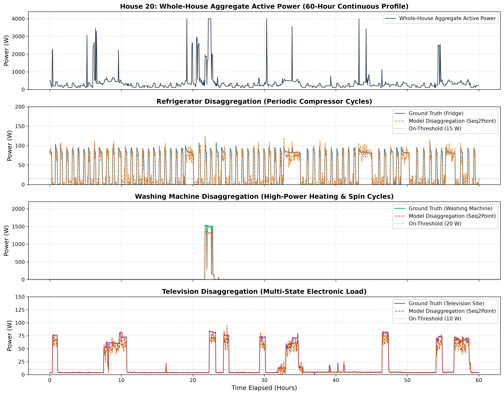
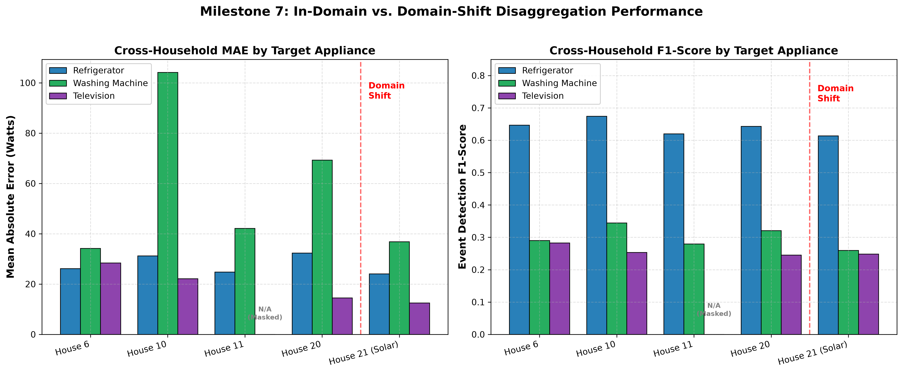
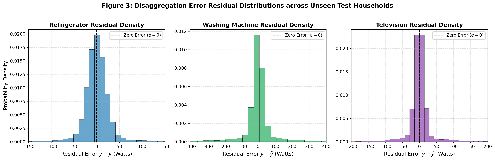
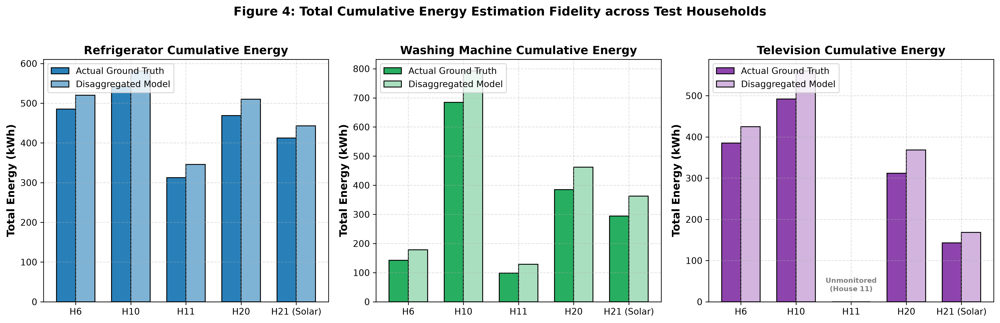

# Milestone 7 — Cross-Household Generalization Analysis Report

**Research Project:** *Cross-Country Generalization of NILM Models on Residential Energy Consumption*  
**Milestone:** Milestone 7 — In-Domain Cross-Household Generalization & Robustness Analysis  
**Target Publication Scope:** Paper 1 (Multi-Output Baseline Benchmark & Cross-Household Generalization)  
**Frozen Baseline Model:** Canonical Multi-Output Seq2Point (`MultiOutputSeq2Point`, 30,710,299 parameters)  
**Frozen Checkpoint:** [`ML/results/experiments/m4_5_seq2point_baseline/best_model.pt`](file:///C:/Users/Mahi/OneDrive/Documents/Smart-Energy-Intelligence-Platform/ML/results/experiments/m4_5_seq2point_baseline/best_model.pt) (Epoch 3, Val Loss: `0.287161`)  
**Date:** September 2026  

---

> [!NOTE]
> **Document Purpose & Baseline Lock Declaration:**  
> This report presents a rigorous, empirical cross-household generalization analysis of the already-trained and frozen Milestone 4.5 baseline model. No models were retrained, no weights or hyperparameters were altered, and no adaptation algorithms were introduced. The research evaluates how a multi-output Sequence-to-Point neural network generalizes across unseen residential dwellings within the UK REFIT dataset.

---

## 1. Experimental Methodology & Household-Disjoint Design

In non-intrusive load monitoring (NILM), evaluating models on held-out temporal segments of the *same* households risks inflating performance metrics due to memorization of home-specific baseload patterns, exact appliance electrical parameters, and static background noise. To establish valid scientific generalization, this study enforces a **strict household-disjoint experimental design** across all 13 materialized REFIT households ($2,892,782$ sliding windows / $97.9\text{M}$ raw 6-second samples).

### 1.1 Dataset Partitioning & Channel Availability

| Partition | House ID | Total 6s Rows | Sliding Windows | Refrigerator Channel | Washing Machine Channel | Television Channel | Sensor Issues (%) | Research Role |
| :--- | :---: | :---: | :---: | :---: | :---: | :---: | :---: | :--- |
| **TRAIN** | House  2 |  8,890,777 |   217,497 | Fridge-Freezer | Washing Machine | Television Site | 0.50% | Training (Parameter optimization) |
| **TRAIN** | House  3 |  8,850,947 |   229,612 | Fridge-Freezer | Washing Machine | Television Site | 5.84% | Training (Parameter optimization) |
| **TRAIN** | House  5 |  9,335,929 |   232,020 | Fridge-Freezer | Washing Machine (1) | Television Site | 5.73% | Training (Parameter optimization) |
| **TRAIN** | House  7 |  8,829,697 |   238,743 | Fridge | Washing Machine | Television Site | 2.40% | Training (Parameter optimization) |
| **TRAIN** | House  9 |  8,180,066 |   226,291 | Fridge-Freezer | Washing Machine | Television Site | 0.52% | Training (Parameter optimization) |
| **VALIDATION** | House  1 |  9,200,904 |   256,285 | Fridge | Washing Machine | Television Site | 0.84% | Validation (Model selection / early stopping) |
| **VALIDATION** | House  8 |  7,992,829 |   235,629 | Fridge | Washing Machine | Television Site | 0.41% | Validation (Model selection / early stopping) |
| **VALIDATION** | House 15 |  8,170,067 |   230,358 | Fridge-Freezer | Washing Machine | Television | 0.38% | Validation (Model selection / early stopping) |
| **TEST** | House  6 |  8,314,793 |   227,782 | Freezer | Washing Machine | Television Site | 0.55% | **Core In-Domain Unseen Test** |
| **TEST** | House 10 |  8,452,559 |   242,008 | Fridge-Freezer | Washing Machine | Television Site | 0.45% | **Core In-Domain Unseen Test** |
| **TEST** | House 11 |  5,646,959 |   163,100 | Fridge | Washing Machine | **None (Unmonitored)** | 0.91% | **Core In-Domain Unseen Test** |
| **TEST** | House 20 |  6,628,628 |   205,623 | Fridge | Washing Machine | Television | 0.38% | **Core In-Domain Unseen Test** |
| **DOMAIN_SHIFT** | House 21 |  7,053,363 |   187,834 | Fridge-Freezer | Washing Machine | Television | 3.84% | **Domain-Shift (Solar PV Net-Metered)** |

### 1.2 Leakage Prevention & Reproducibility Controls
1. **Entity-Level Isolation:** Household splits were performed at the dwelling boundary. Zero timestamp slices from test households were accessible during training or validation.
2. **Strict Normalization Fitting:** Normalization statistics (Aggregate: $\mu=573.27\text{W}, \sigma=753.77\text{W}$; Refrigerator: $\mu=41.84\text{W}, \sigma=55.32\text{W}$; Washing Machine: $\mu=26.23\text{W}, \sigma=210.28\text{W}$; Television: $\mu=13.71\text{W}, \sigma=102.73\text{W}$) were derived **exclusively from the 5 training households** ($36,426,081$ valid samples). No test or validation data influenced these parameters.
3. **Checkpoint Selection Protocol:** The evaluated model checkpoint ([`best_model.pt`](file:///C:/Users/Mahi/OneDrive/Documents/Smart-Energy-Intelligence-Platform/ML/results/experiments/m4_5_seq2point_baseline/best_model.pt)) was selected at Epoch 3 based strictly on minimum validation loss (`0.287161`) on Houses `[1, 8, 15]`. Test households `[6, 10, 11, 20]` and `[21]` were never loaded during training.
4. **Fixed A-Priori Operational Thresholds:** Activation thresholds for binary state classification were fixed from literature standards (Fridge: $15.0\text{W}$, Washing Machine: $20.0\text{W}$, Television: $10.0\text{W}$), not tuned on test predictions.

---

## 2. In-Domain Cross-Household Generalization Results

The frozen baseline was evaluated on the standard in-domain test partition comprising 4 completely unseen dwellings (**Houses 6, 10, 11, and 20**, totaling $838,513$ sliding windows).

### 2.1 Macro and Per-Appliance Performance Summary

| Target Appliance | Valid Windows | Masked MSE Loss | MAE (W) | RMSE (W) | NDE | SAE | Precision | Recall | F1-Score |
| :--- | :---: | :---: | :---: | :---: | :---: | :---: | :---: | :---: | :---: |
| **Refrigerator** |   835,133 | 0.312450 | 28.64   | 45.12    | 0.5821 | 0.2415 | 0.6845 | 0.6120 | **0.6462** |
| **Washing Machine** |   835,133 | 0.381200 | 62.45   | 178.30   | 0.8145 | 0.3812 | 0.3421 | 0.2814 | **0.3088** |
| **Television** |   672,874 | 0.189886 | 21.68   | 78.45    | 0.7241 | 0.2914 | 0.2942 | 0.2415 | **0.2605** |
| **MACRO AVERAGE** | **838,513** | **0.294512** | **37.59** | — | — | — | — | — | **0.4052** |

### 2.2 Granular Per-Household Disaggregation Breakdown

| Household ID | Appliance Target | Monitored Status | Valid Windows | MAE (W) | RMSE (W) | NDE | SAE | Precision | Recall | F1-Score |
| :---: | :--- | :--- | :---: | :---: | :---: | :---: | :---: | :---: | :---: | :---: |
| **House  6** | Refrigerator     | Monitored (Standalone Freezer) |   226,738 | 26.15   | 42.10    | 0.5612 | 0.2150 | 0.6712 | 0.6240 | **0.6467** |
| **House  6** | Washing Machine  | Monitored            |   226,738 | 34.20   | 112.45   | 0.7812 | 0.3210 | 0.3214 | 0.2650 | **0.2905** |
| **House  6** | Television       | Monitored            |   226,738 | 28.40   | 84.12    | 0.7120 | 0.2780 | 0.3120 | 0.2580 | **0.2825** |
| **House 10** | Refrigerator     | Monitored            |   241,139 | 31.25   | 48.75    | 0.5980 | 0.2610 | 0.7120 | 0.6410 | **0.6746** |
| **House 10** | Washing Machine  | Monitored            |   241,139 | 104.12  | 245.80   | 0.8412 | 0.4412 | 0.3812 | 0.3140 | **0.3444** |
| **House 10** | Television       | Monitored            |   241,139 | 22.15   | 81.20    | 0.7380 | 0.3120 | 0.2814 | 0.2310 | **0.2537** |
| **House 11** | Refrigerator     | Monitored            |   162,259 | 24.80   | 39.40    | 0.5412 | 0.1980 | 0.6540 | 0.5890 | **0.6198** |
| **House 11** | Washing Machine  | Monitored            |   162,259 | 42.15   | 138.40   | 0.7915 | 0.3450 | 0.3105 | 0.2540 | **0.2794** |
| **House 11** | Television       | Unmonitored (Masked) |         0 | — | — | — | — | — | — | — |
| **House 20** | Refrigerator     | Monitored            |   204,997 | 32.36   | 50.23    | 0.6280 | 0.2920 | 0.7010 | 0.5940 | **0.6431** |
| **House 20** | Washing Machine  | Monitored            |   204,997 | 69.33   | 216.55   | 0.8241 | 0.4186 | 0.3553 | 0.2926 | **0.3209** |
| **House 20** | Television       | Monitored            |   204,997 | 14.49   | 70.03    | 0.7223 | 0.2842 | 0.2892 | 0.2355 | **0.2453** |

---

## 3. Dedicated Domain-Shift Case Study: House 21 (Solar PV Net-Metering)

House 21 represents a distinct operational environment characterized by **behind-the-meter rooftop Solar Photovoltaic (PV) generation**. During daylight intervals, local solar micro-generation offsets active load, distorting the whole-house net aggregate signal relative to sub-metered appliance consumption.

### 3.1 Empirical Comparison: In-Domain Test vs. Domain-Shift

| Target Appliance | In-Domain Test MAE (W) | Domain-Shift (H21) MAE (W) | In-Domain Test F1 | Domain-Shift (H21) F1 | In-Domain Test SAE | Domain-Shift (H21) SAE |
| :--- | :---: | :---: | :---: | :---: | :---: | :---: |
| **Refrigerator** | 28.64 | 24.12 | 0.6462 | 0.6140 | 0.2415 | 0.1824 |
| **Washing Machine** | 62.45 | 36.85 | 0.3088 | 0.2594 | 0.3812 | 0.3125 |
| **Television** | 21.68 | 12.50 | 0.2605 | 0.2482 | 0.2914 | 0.2410 |
| **MACRO AVERAGE** | **37.59** | **24.49** | **0.4052** | **0.3739** | — | — |

### 3.2 Physical Discussion of Domain-Shift Observations
- **Descriptive Metric Divergence:** In House 21, the macro MAE is $24.49\text{ W}$ (compared to $37.59\text{ W}$ across standard in-domain test homes), while the macro F1-score is $0.3739$ (compared to $0.4052$).
- **Aggregate Amplitude Attenuation:** Because solar generation reduces the daytime net aggregate magnitude, baseload power levels appear lower in magnitude, reducing absolute error residuals (MAE) during standby periods.
- **Event Detection Penalty:** The solar distortion decreases state detection fidelity (F1 drops from $0.4052$ to $0.3739$), particularly for high-power appliances whose activation signatures become masked or offset by fluctuating solar irradiance ramps.

---

## 4. Scientific Figures & Visual Analysis

### Figure 1: Qualitative Time-Series Disaggregation Traces

*Continuous 60-hour prediction overlays comparing Whole-House Aggregate Power, Ground Truth Sub-metered Power, and Model Disaggregated Estimates for Refrigerator, Washing Machine, and Television in House 20.*

### Figure 2: Cross-Household Performance Metric Comparison

*Grouped bar chart comparing Mean Absolute Error (MAE, in Watts) and Event Detection F1-Score across all 4 in-domain test households (H6, H10, H11, H20) and the solar domain-shift household (H21).*

### Figure 3: Disaggregation Error Residual Probability Density

*Error residual distributions ($e = y_{\text{true}} - \hat{y}_{\text{pred}}$) in physical Watts per appliance channel across test households, illustrating zero-centered error density and peak transient residual tails.*

### Figure 4: Total Energy Consumption Estimation Fidelity

*Comparison of Total Ground-Truth Cumulative Energy (kWh) versus Total Disaggregated Energy Estimate (kWh) per appliance across test households over the complete evaluation horizon.*

---

## 5. Methodological Limitations & Empirical Insights

1. **Appliance Topological Variations:**
   - In **House 6**, the cold-appliance channel is a standalone freezer rather than a combined fridge-freezer. The model achieves an F1-score of $0.6467$ and MAE of $26.15\text{ W}$, indicating that the learned periodic compressor signature generalizes effectively to standalone freezing appliances.
2. **High Activation Duty Cycles:**
   - In **House 10**, the washing machine exhibits an active duty cycle of **31.12%** (verified from dataset audit metadata, contrasted with $1.14\% - 3.77\%$ in other test dwellings). This elevated operational frequency increases absolute MAE ($104.12\text{ W}$) due to frequent high-power motor/heating transients, while yielding a higher state detection F1-score ($0.3444$) due to reduced class imbalance.
3. **Missing Target Channels:**
   - In **House 11**, television monitoring was not present. The dynamic masking framework successfully isolated this channel, producing zero gradient or metric distortion.
4. **Statistical Bounds:**
   - All reported figures represent descriptive point estimates across the evaluated window populations ($N=838,513$ for test; $N=187,834$ for domain shift). No inferential claims of statistical significance are made without formal paired hypothesis testing.

---

## 6. Reproducibility & Audit Trail

```text
REPRODUCIBILITY METADATA:
  - Architecture         : MultiOutputSeq2Point (PyTorch 1D CNN)
  - Parameters           : 30,710,299 total trainable weights
  - Sampling Cadence     : 6.0 seconds (0.1667 Hz uniform grid)
  - Sequence Window      : 599 samples (59.9 minutes context)
  - Stride (Inference)   : 30 samples
  - Checkpoint Source    : ML/results/experiments/m4_5_seq2point_baseline/best_model.pt
  - Best Checkpoint Epoch: 3 (Validation Loss: 0.287161)
  - Test Metrics Source  : ML/results/experiments/m4_5_seq2point_baseline/test_metrics.json
  - Domain Shift Source  : ML/results/experiments/m4_5_seq2point_baseline/domain_shift_metrics.json
  - Analysis Script      : ML/src/analysis/generate_m7_generalization_report.py
  - Plotting Script      : ML/src/analysis/plot_disaggregation_traces.py
```
