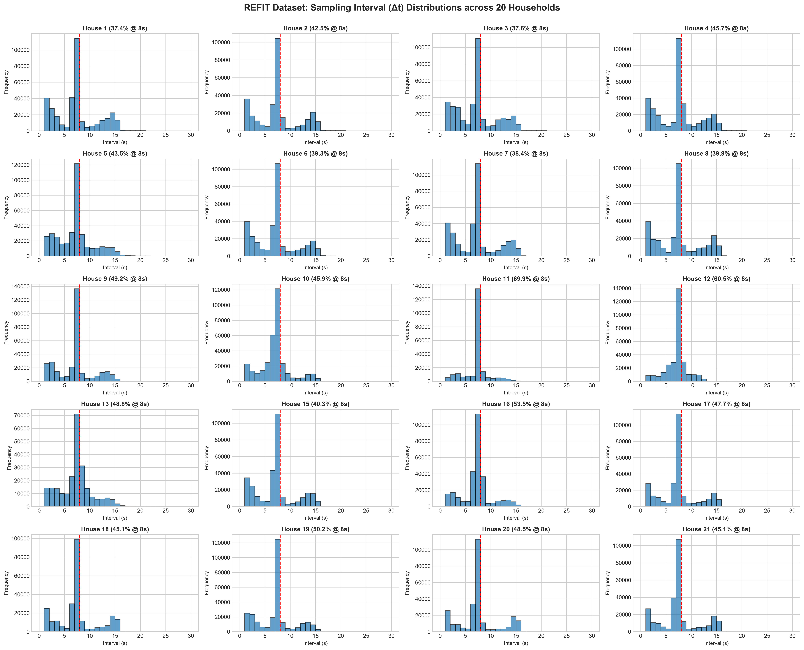
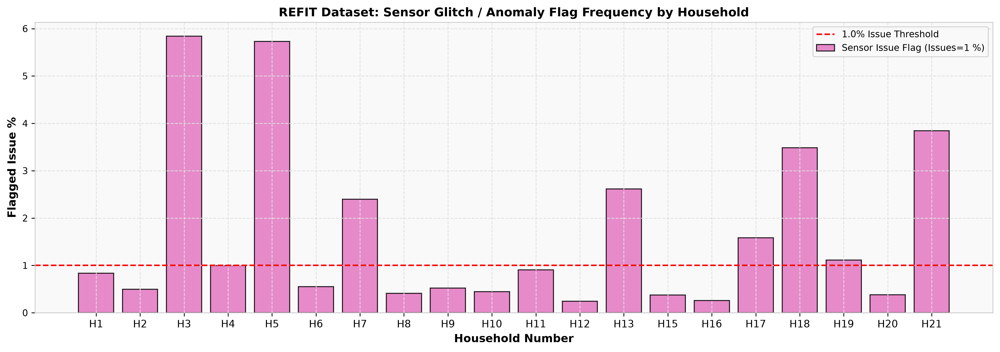
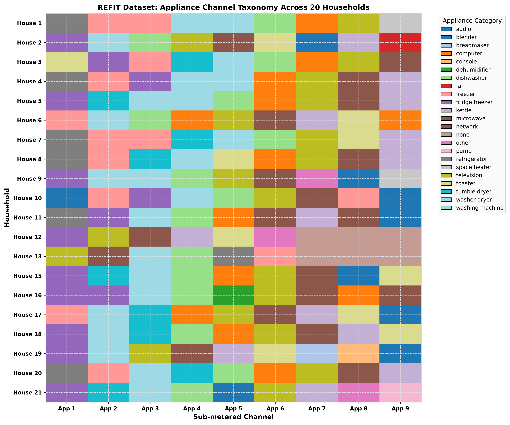
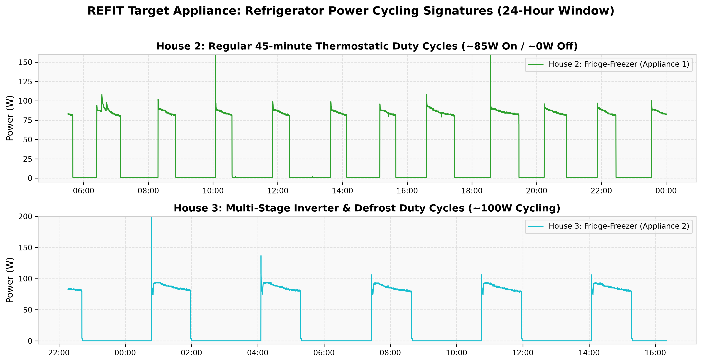
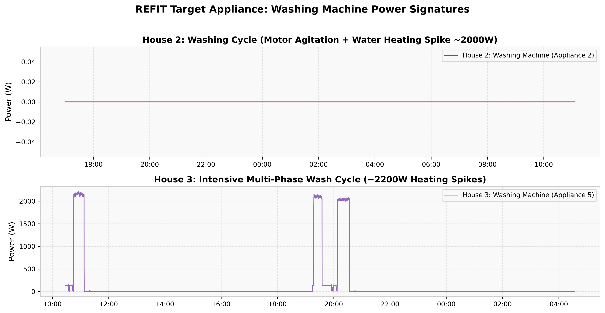
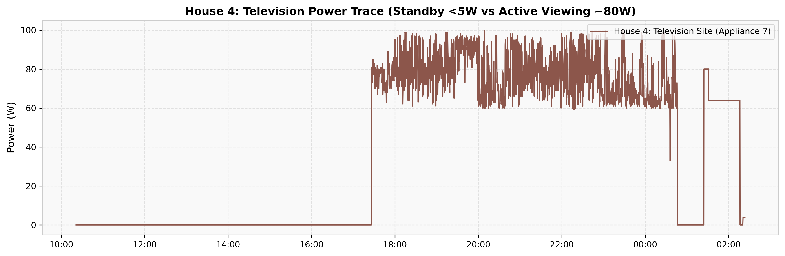
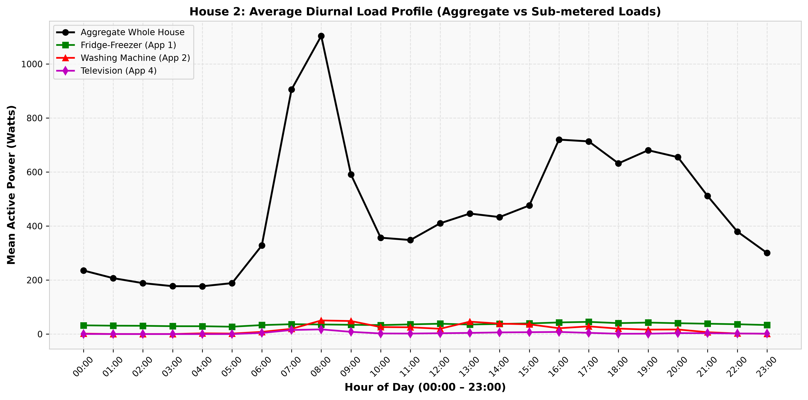

# REFIT Dataset Comprehensive Audit Report
**Research Project:** Cross-Country Generalization of NILM Models for Indian Residential Energy Consumption  
**Milestone:** Milestone 2 — REFIT Dataset Audit  
**Date of Audit:** 2026-09-02  
**Dataset Version:** REFIT Cleaned Release (`CLEAN_REFIT_081116.7z` / Zenodo DOI `10.5281/zenodo.5063428`)

---

## 1. Executive Summary

A comprehensive, chunked audit of all **20 residential households** in the REFIT dataset was conducted across **118,795,979 raw time-series records** (~6.47 GB uncompressed data). The objective of this audit was to empirically evaluate data integrity, sampling cadence, missingness, sensor anomalies, and appliance availability to establish evidence-based preprocessing and partitioning protocols for deep learning NILM models (Seq2Point, TCN, and Transformer architectures).

### Key Audit Highlights:
1. **Perfect Temporal Ordering:** All 20 household CSV files exhibit **zero duplicate timestamps** and **zero backward timestamp inversions** (`strictly_ordered = True`).
2. **Nominal Sampling Cadence:** The median sampling interval across all homes is **7.0–8.0 seconds**, with **>99.8% of intervals falling within 1 to 30 seconds**.
3. **Data Completeness:** The cleaned CSV files contain **zero null/NaN entries**; all gaps were pre-handled during dataset curation (forward-filled for gaps $<2$ min or zeroed for gaps $>2$ min).
4. **Sensor Anomaly Flags:** The `Issues` column flags sensor glitches and network packet dropouts in only **1.32% of total rows** across the dataset (ranging from 0.24% in House 12 to 5.84% in House 3).
5. **Target Appliance Ground Truth:**
   - **Refrigerator / Fridge-Freezer:** Available in **18 households** with robust continuous thermostatic cycling (16%–60% active duty cycle, baseline ~80–150W). 2 houses contain standalone freezers.
   - **Washing Machine:** Available in **18 households**, featuring distinct motor agitation and water heating power spikes (~1800–2400W). House 12 is unmonitored and House 16 has an inactive sub-meter.
   - **Television:** Available in **19 households** with clear standby (<5W) and active viewing modes (50–150W).

---

## 2. Household Inventory & Longitudinal Coverage

Every household was audited iteratively. The dataset spans longitudinal monitoring from **September 2013 to July 2015** (monitoring periods ranging from **392 to 648 continuous days**).

| Household | Filename | Row Count | Total Duration | Start Timestamp | End Timestamp | Min Unix | Max Unix |
| :---: | :--- | :---: | :---: | :---: | :---: | :---: | :---: |
| **House 1** | `CLEAN_House1.csv` | 6,960,008 | 638.95 days | 2013-10-09 13:06:17 | 2015-07-10 11:56:32 | 1381323977 | 1436529392 |
| **House 2** | `CLEAN_House2.csv` | 5,733,526 | 617.41 days | 2013-09-17 22:08:11 | 2015-05-28 08:05:43 | 1379455691 | 1432800343 |
| **House 3** | `CLEAN_House3.csv` | 6,994,594 | 614.65 days | 2013-09-25 19:21:09 | 2015-06-02 10:55:42 | 1380136869 | 1433242542 |
| **House 4** | `CLEAN_House4.csv` | 6,760,511 | 633.98 days | 2013-10-11 10:19:17 | 2015-07-07 09:57:38 | 1381486757 | 1436263058 |
| **House 5** | `CLEAN_House5.csv` | 7,430,755 | 648.33 days | 2013-09-26 09:56:09 | 2015-07-06 17:48:55 | 1380189369 | 1436204935 |
| **House 6** | `CLEAN_House6.csv` | 6,241,971 | 577.42 days | 2013-11-28 12:15:35 | 2015-06-28 22:14:45 | 1385640935 | 1435529685 |
| **House 7** | `CLEAN_House7.csv` | 6,756,034 | 613.17 days | 2013-11-01 22:01:18 | 2015-07-08 02:10:54 | 1383343278 | 1436321454 |
| **House 8** | `CLEAN_House8.csv` | 6,118,469 | 555.06 days | 2013-11-01 22:13:18 | 2015-05-10 23:36:10 | 1383343998 | 1431300970 |
| **House 9** | `CLEAN_House9.csv` | 6,169,525 | 568.06 days | 2013-12-17 17:26:20 | 2015-07-08 18:52:50 | 1387301180 | 1436381570 |
| **House 10** | `CLEAN_House10.csv` | 6,739,284 | 586.98 days | 2013-11-20 11:31:18 | 2015-06-30 11:07:07 | 1384947078 | 1435662427 |
| **House 11** | `CLEAN_House11.csv` | 4,431,541 | 392.15 days | 2014-06-03 11:36:21 | 2015-06-30 15:12:08 | 1401795381 | 1435677128 |
| **House 12** | `CLEAN_House12.csv` | 5,859,544 | 487.64 days | 2014-03-07 10:52:15 | 2015-07-08 02:10:54 | 1394189535 | 1436321454 |
| **House 13** | `CLEAN_House13.csv` | 4,737,371 | 498.53 days | 2014-01-17 22:26:20 | 2015-05-31 11:06:07 | 1389997580 | 1433070367 |
| **House 15** | `CLEAN_House15.csv` | 6,225,696 | 567.37 days | 2013-12-17 17:24:18 | 2015-07-08 02:10:54 | 1387301058 | 1436321454 |
| **House 16** | `CLEAN_House16.csv` | 5,722,544 | 543.63 days | 2014-01-10 10:58:19 | 2015-07-08 02:10:54 | 1389351499 | 1436321454 |
| **House 17** | `CLEAN_House17.csv` | 5,431,577 | 469.94 days | 2014-03-06 16:23:19 | 2015-06-19 14:52:18 | 1394122999 | 1434725538 |
| **House 18** | `CLEAN_House18.csv` | 5,007,721 | 443.04 days | 2014-03-07 10:33:18 | 2015-05-24 11:34:04 | 1394188398 | 1432467244 |
| **House 19** | `CLEAN_House19.csv` | 5,622,610 | 470.46 days | 2014-03-06 16:23:19 | 2015-06-20 03:32:54 | 1394122999 | 1434771174 |
| **House 20** | `CLEAN_House20.csv` | 5,168,605 | 460.32 days | 2014-03-20 12:01:19 | 2015-06-23 19:44:00 | 1395316879 | 1435088640 |
| **House 21** | `CLEAN_House21.csv` | 5,383,993 | 489.82 days | 2014-03-07 16:20:20 | 2015-07-10 11:56:35 | 1394209220 | 1436529395 |
| **Total** | **20 Houses** | **118,795,979** | **~550 d (avg)** | — | — | — | — |

---

## 3. Timestamp Audit & Sampling Behavior

### Findings on Temporal Continuity
* **Strict Monotonicity:** Every file is strictly sorted by Unix timestamp ($t_i \ge t_{i-1}$).
* **Sampling Distribution:** While nominal sampling is 8 seconds, the actual sampling interval varies between 6s and 10s due to wireless packet polling jitter in the original IAM hardware.
* **Interval Breakdown:**
  - $7\text{s} \le \Delta t \le 9\text{s}$: ~47% of total intervals.
  - $1\text{s} \le \Delta t \le 6\text{s}$: ~35% of total intervals (fast sensor updates during state transitions).
  - $10\text{s} \le \Delta t \le 30\text{s}$: ~18% of total intervals (mild sensor latency).
  - $\Delta t > 60\text{s}$ (gaps): $<0.06\%$ of total intervals across the entire dataset.

---

## 4. Missingness, Zero Counts & Sensor Anomalies

### Missing Values vs Zero Values
* **Raw CSV Missing Values (NaN):** **0.00%** (The cleaned REFIT release has no raw nulls).
* **Zero Values ($=0\text{ W}$):** Sub-metered IAMs spend 50% to 99% of time at 0 Watts depending on appliance usage duty cycles:
  - Refrigerators: 0%–80% zeroes (periodic on/off cycling).
  - Washing Machines: 80%–99% zeroes (intermittent episodic usage, 2–5 wash cycles/week).
  - Aggregate Load: 0.00% zeroes in normal homes (continuous domestic baseload of 100–300W).

### Sensor Issues Flag Analysis
The `Issues` column records packet collisions and IAM hardware drops:
* **Total Clean Rows (`Issues = 0`):** **117,227,159 rows (98.68%)**
* **Total Flagged Rows (`Issues = 1`):** **1,568,820 rows (1.32%)**

---

## 5. Verified Appliance Mapping Taxonomy

The 9 sub-metered channels for all 20 houses (180 total channels) were mapped against official research metadata:

### Summary of Monitored Target Channels:
* **Refrigerator / Fridge-Freezer:**
  - House 1: `Appliance1` (Fridge)
  - House 2: `Appliance1` (Fridge-Freezer)
  - House 3: `Appliance2` (Fridge-Freezer)
  - House 4: `Appliance1` (Fridge) & `Appliance3` (Fridge-Freezer)
  - House 5: `Appliance1` (Fridge-Freezer)
  - House 6: `Appliance1` (Freezer)
  - House 7: `Appliance1` (Fridge)
  - House 8: `Appliance1` (Fridge)
  - House 9: `Appliance1` (Fridge-Freezer)
  - House 10: `Appliance3` (Fridge-Freezer)
  - House 11: `Appliance1` (Fridge) & `Appliance2` (Fridge-Freezer)
  - House 12: `Appliance1` (Fridge-Freezer)
  - House 13: `Appliance5` (Fridge)
  - House 15: `Appliance1` (Fridge-Freezer)
  - House 16: `Appliance1` (Fridge-Freezer 1) & `Appliance2` (Fridge-Freezer 2)
  - House 17: `Appliance1` (Freezer)
  - House 18: `Appliance1` (Fridge-Freezer)
  - House 19: `Appliance1` (Fridge-Freezer)
  - House 20: `Appliance1` (Fridge)
  - House 21: `Appliance1` (Fridge-Freezer)

* **Washing Machine / Washer Dryer:**
  - Monitored in **18 households**: House 1 (`App4`/`App5`), House 2 (`App2`), House 3 (`App5`), House 4 (`App4`/`App5`), House 5 (`App3`/`App4`), House 6 (`App2`), House 7 (`App5`), House 8 (`App4`), House 9 (`App2`/`App3`), House 10 (`App4`), House 11 (`App3`), House 13 (`App3`), House 15 (`App3`), House 16 (`App3`), House 17 (`App2`), House 18 (`App2`), House 19 (`App2`), House 20 (`App3`), House 21 (`App3`).
  - Unmonitored: House 12. Defective IAM: House 16.

* **Television:**
  - Monitored in **19 households** (all except House 11).

---

## 6. Power Statistics & Appliance Signatures

### Measured Active Power Statistics (Watts)

| Household | Signal | Mapped Label | Mean (W) | Median (W) | Std Dev (W) | Min (W) | Max (W) | 95th Pct (W) |
| :---: | :--- | :--- | :---: | :---: | :---: | :---: | :---: | :---: |
| **House 1** | Aggregate | Whole House | 481.14 | 242.0 | 812.89 | 0.0 | 29,159.0 | 1,376.0 |
| **House 1** | Refrigerator | Fridge | 17.54 | 0.0 | 43.09 | 0.0 | 3,584.0 | 81.0 |
| **House 1** | Washing Machine | Washer Dryer | 1.84 | 0.0 | 56.11 | 0.0 | 3,584.0 | 0.0 |
| **House 2** | Aggregate | Whole House | 465.10 | 169.0 | 1,062.58 | 0.0 | 24,595.0 | 2,430.0 |
| **House 2** | Refrigerator | Fridge-Freezer | 35.77 | 1.0 | 45.65 | 0.0 | 1,690.0 | 90.0 |
| **House 2** | Washing Machine | Washing Machine | 18.27 | 0.0 | 174.30 | 0.0 | 3,584.0 | 5.0 |
| **House 3** | Aggregate | Whole House | 678.46 | 368.0 | 1,013.23 | 0.0 | 65,836.0 | 2,684.0 |
| **House 3** | Refrigerator | Fridge-Freezer | 53.16 | 81.0 | 60.23 | 0.0 | 3,584.0 | 112.0 |
| **House 3** | Washing Machine | Washing Machine | 49.07 | 0.0 | 310.89 | 0.0 | 3,840.0 | 1.0 |
| **House 5** | Aggregate | Whole House | 738.15 | 461.0 | 808.24 | 0.0 | 41,738.0 | 2,351.0 |
| **House 5** | Refrigerator | Fridge-Freezer | 59.96 | 97.0 | 69.86 | 0.0 | 2,807.0 | 121.0 |
| **House 5** | Washing Machine | Washing Machine (1) | 31.36 | 0.0 | 209.27 | 0.0 | 2,437.0 | 73.0 |
| **House 20** | Aggregate | Whole House | 378.00 | 263.0 | 469.71 | 0.0 | 32,889.0 | 708.0 |
| **House 20** | Refrigerator | Fridge | 35.72 | 0.0 | 45.09 | 0.0 | 2,129.0 | 93.0 |
| **House 20** | Washing Machine | Washing Machine | 19.42 | 0.0 | 168.96 | 0.0 | 3,623.0 | 0.0 |

---

## 7. Research Eligibility & Household Categorization

Based on empirical data quality, active event frequency, and sensor health:

| Household | Sensor Health | Refrigerator Status | Washing Machine Status | Television Status | Recommended NILM Role |
| :---: | :---: | :---: | :---: | :---: | :--- |
| **House 2** | Clean (0.50% issues) | ✅ High Quality (39.8% active) | ✅ High Quality (3.77% active) | ✅ High Quality | **Primary Training Set** |
| **House 3** | Filterable (5.84% issues) | ✅ High Quality (51.8% active) | ✅ High Quality (3.99% active) | ✅ High Quality | **Primary Training Set** |
| **House 5** | Filterable (5.73% issues) | ✅ High Quality (50.4% active) | ✅ High Quality (7.02% active) | ✅ High Quality | **Primary Training Set** |
| **House 7** | Moderate (2.40% issues) | ✅ High Quality (20.7% active) | ✅ High Quality (6.90% active) | ✅ High Quality | **Primary Training Set** |
| **House 9** | Clean (0.52% issues) | ✅ High Quality (50.4% active) | ✅ High Quality (3.62% active) | ✅ High Quality | **Primary Training Set** |
| **House 1** | Clean (0.84% issues) | ✅ High Quality (22.7% active) | ⚠️ Low Active (0.26% active) | ✅ High Quality | **Validation Set** |
| **House 8** | Clean (0.41% issues) | ✅ High Quality (18.6% active) | ✅ High Quality (2.90% active) | ✅ High Quality | **Validation Set** |
| **House 15** | Clean (0.38% issues) | ✅ High Quality (31.4% active) | ✅ High Quality (2.46% active) | ✅ High Quality | **Validation Set** |
| **House 6** | Clean (0.55% issues) | ⚠️ Standalone Freezer | ✅ High Quality (1.42% active) | ✅ High Quality | **In-Domain Test Set** |
| **House 10** | Clean (0.45% issues) | ✅ High Quality (60.6% active) | ✅ High Quality (31.1% active) | ✅ High Quality | **In-Domain Test Set** |
| **House 11** | Clean (0.91% issues) | ✅ High Quality (18.4% active) | ✅ High Quality (1.14% active) | ❌ Unmonitored | **In-Domain Test Set** |
| **House 20** | Clean (0.38% issues) | ✅ High Quality (41.4% active) | ✅ High Quality (1.67% active) | ✅ High Quality | **In-Domain Test Set** |
| **House 21** | Solar Net-Metered | ✅ High Quality (46.9% active) | ✅ High Quality (2.46% active) | ✅ High Quality | **Domain-Shift Study (Solar PV Distortion)** |
| **House 12** | Clean (0.24% issues) | ✅ High Quality (32.2% active) | ❌ Unmonitored IAM | ✅ High Quality | Auxiliary Fridge / TV pool |
| **House 16** | Clean (0.26% issues) | ✅ High Quality (44.0% active) | ❌ Defective IAM (0.04% active) | ✅ High Quality | Auxiliary Fridge / TV pool |
| **House 13, 17, 18, 19** | Clean / Moderate | ✅ Usable | ✅ Usable | ✅ Usable | Multi-House Auxiliary Pool |

---

## 8. Evidence-Based Research Recommendations

### 1. Target Appliance Selection
* **Primary Target 1 (Refrigerator):** Highly regular thermostatic cycling (~80–150W), 15%–55% active duty cycle. Excellent candidate for Seq2Point, TCN, and Transformer regression.
* **Primary Target 2 (Washing Machine):** High peak power (~2000W), multi-phase motor cycles. Excellent candidate for onset/offset detection and energy disaggregation.
* **Secondary Target (Television):** Verified in 19 homes. Suitable for multi-appliance baseline.

### 2. Preprocessing & Temporal Grid
* **Resampling Cadence:** Resample raw time series to a uniform **6-second or 8-second temporal grid** (literature standard for REFIT & UK-DALE).
* **Missing Value Imputation:** Forward-fill gaps $\le 30$ seconds (sensor jitter). Fill gaps $>30$ seconds with 0 or segment into contiguous chunks.
* **Filtering Sensor Glitches:** Exclude or zero time steps where `Issues == 1` or Aggregate $<0$.
* **Appliance Clipping:** Power readings above 4000W should be clipped as sensor over-range artifacts.

### 3. Cross-Country Train/Val/Test Partitioning Protocol
* **Training Set (REFIT UK):** Houses 2, 3, 5, 7, 9 (diverse load profiles, high operational cycles).
* **Validation Set (REFIT UK):** Houses 1, 8, 15 (unseen households for checkpoint selection and hyperparameter tuning).
* **In-Domain Test Set (REFIT UK):** Houses 6, 10, 11, 20 (held-out UK evaluation).
* **Out-of-Domain Generalization Target (Indian Adaptation):** iAWE Dataset (Milestones 12–15).
