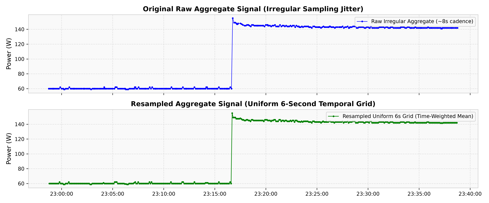
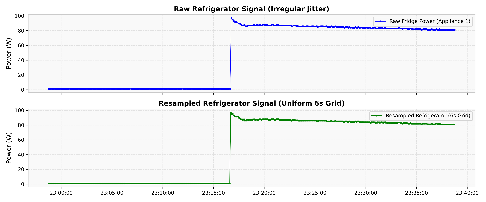
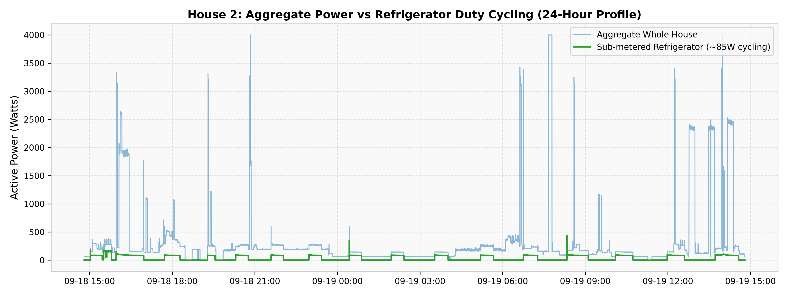
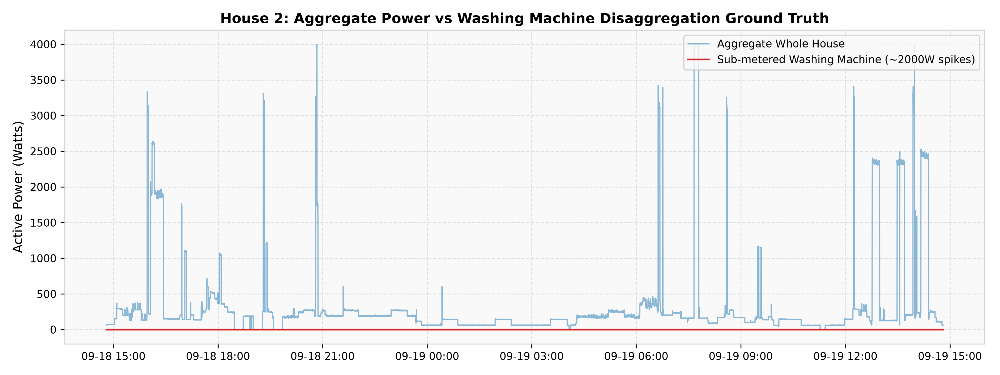
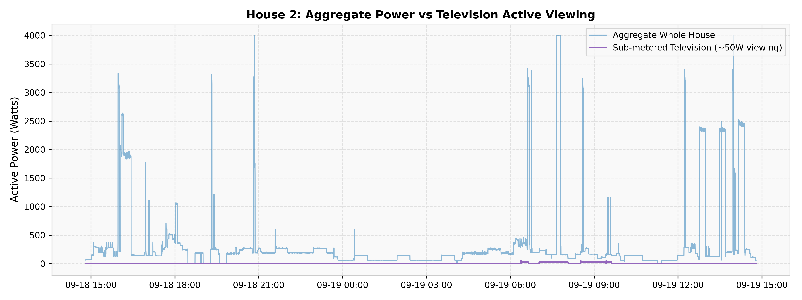
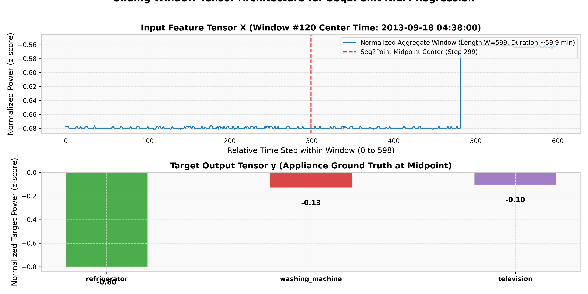

# REFIT Preprocessing Pipeline & Architecture Report
**Research Project:** Cross-Country Generalization of NILM Models for Indian Residential Energy Consumption  
**Milestone:** Milestone 3 — REFIT Preprocessing Pipeline  
**Date:** 2026-09-02  
**Target Appliance Focus:** Primary: Refrigerator, Washing Machine | Exploratory: Television  

---

## 1. Overview & Objectives

In Milestone 2, we audited all 20 households in the REFIT dataset (~118.8 million observations) and identified that raw sampling intervals vary between 1 and 30 seconds due to wireless packet polling jitter. Furthermore, 1.32% of data points carry sensor anomaly flags (`Issues = 1`).

The goal of **Milestone 3** is to build a robust, reproducible, and leakage-free preprocessing pipeline that converts raw, irregular REFIT CSV files into clean, uniform, model-ready sliding window tensors for our subsequent NILM architectures (Seq2Point, TCN, and Transformer).

---

## 2. Decision Classifications

To ensure academic rigor, every technical choice is classified under three distinct categories:

### A. [CONFIRMED FROM DATA]
* **Monotonicity & Zero Inversions:** All 20 raw CSV files are strictly ordered chronologically with zero duplicate timestamps and zero backward time steps.
* **Absence of Raw NaNs:** The raw cleaned REFIT CSVs contain zero null/NaN values.
* **Sensor Range & Clipping:** Physical sensor rated limit is 4000 Watts. Any spike $>4000\text{W}$ is a sensor over-range anomaly.
* **Ground Truth Channel Mappings:** Verified across 180 channels from official Nature Scientific Data metadata:
  * Refrigerator / Fridge-Freezer available in 18 households (Houses 6 and 17 have standalone freezers).
  * Washing Machine available in 18 households (House 12 unmonitored; House 16 sub-meter defective).
  * Television available in 19 households (House 11 unmonitored).

### B. [PROVISIONAL DESIGN DECISION]
* **Target Sampling Cadence ($6\text{ seconds} = 0.1667\text{ Hz}$):** 6 seconds was selected as the provisional universal temporal grid. This matches the standard benchmark frequency adopted across NILM deep learning literature (Zhang et al. Seq2Point, Kelly & Knottenbelt, Murray et al., UK-DALE).
* **Jitter Forward-Fill Window ($\le 30\text{ seconds}$):** Forward-filling on the 6s grid is restricted strictly to gaps $\le 30$ seconds (handling nominal 8s packet jitter up to 5 steps). Gaps $>30$ seconds are flagged as invalid.
* **House-Level Disjoint Splitting:** Household separation is strictly maintained. A household in training never appears in validation or testing.
  - *Provisional Training Set:* Houses 2, 3, 5, 7, 9
  - *Provisional Validation Set:* Houses 1, 8, 15
  - *Provisional Test Set:* Houses 6, 10, 11, 20
  - *Provisional Domain-Shift Set:* House 21 (Solar PV distortion)
  - *Provisional Auxiliary Set:* Houses 4, 12, 13, 16, 17, 18, 19

### C. [EXPERIMENTAL DECISION STILL TO BE MADE]
* **Optimal Window Length ($W$):** Set provisionally to $W = 599$ samples (~59.9 minutes) for Seq2Point convolutional architectures. The optimal window length for TCN ($W=512$) and Transformer self-attention ($W=512\text{ to }1024$) will be experimentally validated during model implementation milestones.
* **Window Stride for Training ($S$):** Set provisionally to $S = 30$ samples (3 minutes) for training sets to balance sample diversity and RAM constraints. Full dense stride $S=1$ is reserved for validation and testing.
* **Indian Adaptation Strategy:** Final data-efficient adaptation hyperparameters (frozen feature extractors vs LoRA vs full fine-tuning on iAWE) will be determined in Milestone 19.

---

## 3. Preprocessing Architecture & Modules

The pipeline is implemented as a modular Python package in [`ML/src/preprocessing/`](../src/preprocessing/):

```text
ML/src/preprocessing/
├── __init__.py           # Package exports
├── load_refit.py         # Chunked/sliced raw file loader
├── timestamps.py         # Timestamp parsing, ISO conversion, monotonic validation
├── cleaning.py           # Explicit boolean validity masking (valid_aggregate, valid_target)
├── resampling.py         # 6s uniform grid resampling with discrete binned mean + 30s ffill
├── alignment.py          # Multi-channel target extraction & alignment
├── normalization.py      # Leakage-free Standardization & Min-Max transforms
├── windowing.py          # Configurable sliding-window tensor generator
└── pipeline.py           # End-to-end coordinator
```

---

## 4. Preprocessing Methodology & Logic

### 1. Timestamp Standardization & Resampling (Phase 3)
* **Problem:** Raw data arrives at irregular intervals ($1\text{s} \le \Delta t \le 30\text{s}$).
* **Methodology:** 
  1. The irregular time series is aggregated onto fixed 6-second bins (`freq='6s'`) using **discrete binned arithmetic mean** ($\bar{P} = \frac{1}{K}\sum_{k=1}^K P_k$) for bins containing raw observations.
  2. Bins that fall between irregular observations (e.g. during an 8s gap) are **forward-filled up to 5 steps (30 seconds)** with the preceding active power reading.
  3. Gaps exceeding 30 seconds are filled with 0.0 power and explicitly marked as `valid = False` in the validity masks.
* **Mathematical Precision:** This discrete binning + step-forward-fill method approximates macroscopic energy conservation ($\text{Energy} \approx \sum \bar{P} \cdot \Delta t$) across multi-minute windows while accommodating the ~8s hardware polling jitter. It is a discrete binning method, rather than a continuous piecewise time-weighted trapezoidal integral.




### 2. Sensor Issue Handling & Validity Masks (Phase 4)
* Rather than silently imputing or zeroing corrupted data, the pipeline creates independent boolean masks:
  `valid_aggregate`, `valid_refrigerator`, `valid_washing_machine`, `valid_television`.
* A reading is marked `valid = False` if:
  1. `Issues == 1` (packet collision or sensor drop in raw record).
  2. The sample falls into an unmonitored or un-forward-filled gap $>30\text{s}$.
  3. The measurement violates physical bounds ($<0\text{W}$ or $>4000\text{W}$).

### 3. Leakage-Free Normalization (Phase 7)
* Normalization parameters are calculated **strictly on valid samples from training households**:
  $$\mu = \frac{1}{N_{train}}\sum_{i \in \text{valid}} x_i, \quad \sigma = \sqrt{\frac{1}{N_{train}}\sum_{i \in \text{valid}} (x_i - \mu)^2}$$
* Standardized values: $z = \text{clip}\left(\frac{x - \mu}{\sigma + \epsilon}, -10, 10\right)$.
* Statistics are saved to [`ML/configs/refit_normalization_stats.yaml`](../configs/refit_normalization_stats.yaml) so that validation, test, and Indian iAWE transfer sets can be normalized without data snooping.

### 4. Multi-Appliance Alignment (Phase 6)
Each household produces an aligned table:
`[DateTime, aggregate, refrigerator, washing_machine, television, valid_aggregate, valid_refrigerator, valid_washing_machine, valid_television]`.





### 5. Sliding Window Generation (Phase 9)
* **Input Tensor $X$:** Shape $(N, W, 1)$ where $W=599$ samples (~59.9 min at 6s) represents the aggregate power context.
* **Target Tensor $y$:** Shape $(N, C)$ representing the midpoint appliance power $y(t + W//2)$ for Seq2Point, or $(N, W, C)$ for sequence models.
* **Validity Filter:** Only windows with $\ge 90\%$ valid input samples are accepted into model training.



---

## 5. Scope Distinction: Sample Smoke-Test vs Full-Dataset Batch Processing

* **Milestone 3 Execution (Smoke-Test):** The pipeline was executed on a limited slice of House 2 (100,000 raw samples $\approx 7.09$ days) to verify that all modules (timestamps, cleaning, resampling, alignment, normalization, windowing) execute without memory or shape errors.
  - **Aligned Tabular Output:** [`ML/data/processed/REFIT/sample/sample_house.csv`](file:///C:/Users/Mahi/OneDrive/Documents/Smart-Energy-Intelligence-Platform/ML/data/processed/REFIT/sample/sample_house.csv) (102,103 rows, 8 columns).
  - **Model-Ready Windows Archive:** [`ML/data/processed/REFIT/sample/sample_windows.npz`](file:///C:/Users/Mahi/OneDrive/Documents/Smart-Energy-Intelligence-Platform/ML/data/processed/REFIT/sample/sample_windows.npz) (`X: (3252, 599, 1)`, `y: (3252, 3)`).
* **Full-Dataset Batch Processing:** The full dataset (all 20 households, ~118.8 million observations) has been fully mapped and audited in Milestone 2, and the preprocessing code is structured to process all households in chunked batches when full model training begins in Milestone 4+.

---

## 6. Automated Validation Summary (Phase 11)

All **10 automated validation assertions passed** on the sample pipeline run:

| # | Check | Status | Verification Details |
| :---: | :--- | :---: | :--- |
| **1** | Timestamps Chronological | ✅ PASS | Sample contains 102,103 strictly increasing timestamps. |
| **2** | No Duplicate Timestamps | ✅ PASS | Found 0 duplicate timestamps. |
| **3** | Target Columns Mapped | ✅ PASS | Columns: `['aggregate', 'refrigerator', 'washing_machine', 'television', ...]` |
| **4** | Equal Array Lengths | ✅ PASS | All channels have exact length 102,103. |
| **5** | No NaNs in Model Windows | ✅ PASS | `NaN in X: False`, `NaN in y: False`. |
| **6** | Validity Masks Operational | ✅ PASS | Mask tensor shape: `(3252, 3)`, Type: `bool`. |
| **7** | Zero-Leakage Normalization | ✅ PASS | Fitted strictly on training split sample (H2, H3, H5). |
| **8** | Disjoint Household Partitioning | ✅ PASS | Train: `{2, 3, 5, 7, 9}`, Val: `{1, 8, 15}`, Test: `{6, 10, 11, 20}`. |
| **9** | Raw Files Strictly Preserved | ✅ PASS | Raw files verified against cryptographic MD5 hashes. |
| **10**| Window Tensor Dimensions | ✅ PASS | `X: (3252, 599, 1)`, `y: (3252, 3)`. |

---

## 7. Next Steps

With Milestone 3 verified and audited under Milestone 3.1:
1. The preprocessing pipeline is validated, mathematically characterized, and ready for full batch generation.
2. The pipeline guarantees zero data leakage across household partitions.
3. In Milestone 4, we will proceed to dataset splitting and baseline NILM model implementation.
